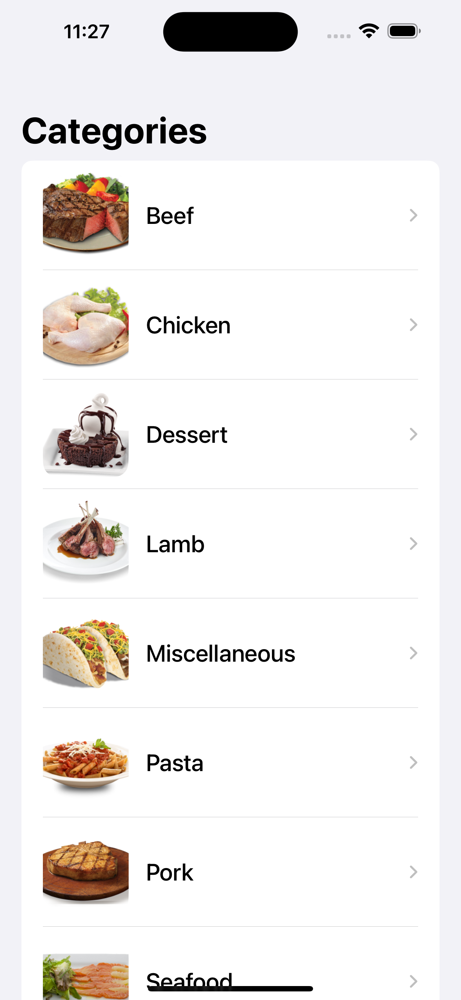
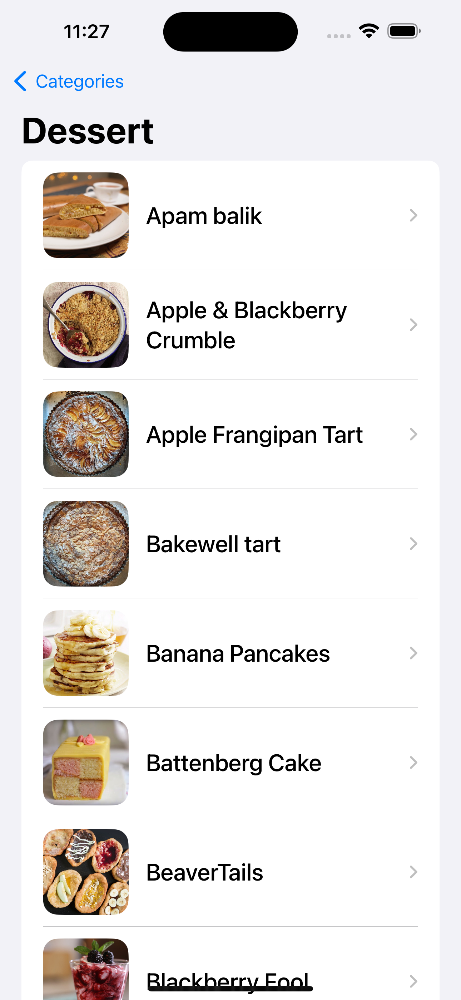
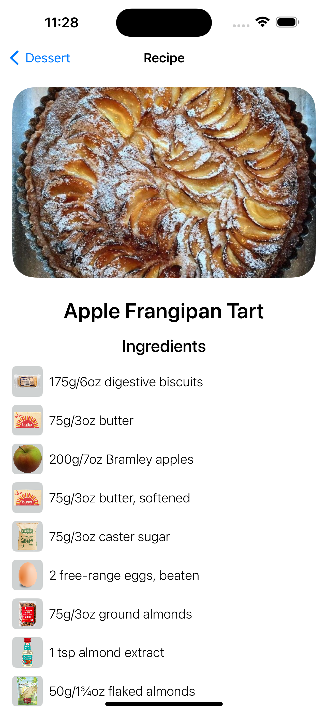

# MealsApp

MealsApp is a SwiftUI-based iOS application that allows users to explore different meals, recipes, and categories. This app leverages the [TheMealDB API](https://www.themealdb.com/) to provide a wide variety of recipes and culinary inspiration.

## Features

- Browse and discover meals by categories.
- View detailed information about a specific meal, including ingredients, instructions, and images.
- Watch recipe videos through integrated YouTube links.
- Explore a rich collection of culinary delights.

## Screenshots


*Categories List*


*Meals by Category List.*


*Meal Recipe*

## Getting Started

Follow these steps to get the app up and running on your local machine:

1. Clone the repository:

    ```bash
    git clone https://github.com/MarcelaGonc/MealsApp.git
    ```

2. Open the project in Xcode.

3. Build and run the app on the iOS simulator or a physical device.

## Contributing

If you'd like to contribute to MealsApp, please follow these guidelines:

1. Fork the repository.

2. Create a new branch:

    ```bash
    git checkout -b feature/your-feature-name
    ```

3. Make your changes and commit them:

    ```bash
    git commit -m "Add your commit message here"
    ```

4. Push to the branch:

    ```bash
    git push origin feature/your-feature-name
    ```

5. Open a pull request.

## License

This project is licensed under the [MIT License](LICENSE).

## Acknowledgments

- Thanks to [TheMealDB](https://www.themealdb.com/) for providing the API.
